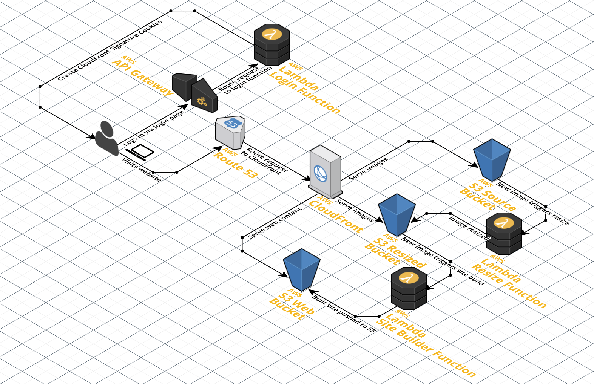

# AWSPics

> An AWS CloudFormation stack to run a serverless password-protected photo
  gallery

**Example:** <https://v2.awspics.net>  
**Credentials:** "username" / "password"

## Goals

Host a self-contained, password-protected, data-driven static photo gallery to
share personal pictures with friends and family, without needing to run,
maintain (or pay for) servers.

## Architecture



There are 7 main components:

1. **CloudFront with restricted bucket access** to prevent unauthenticated
   access to the site or its pictures.
2. **Login lambda function** to validate authentication and sign cookies to
   allow access to restricted buckets.
3. **Source S3 bucket** to store original pictures and metadata driving the
   site.
4. **Resized S3 bucket** to store resized versions of the original pictures.
5. **Web S3 bucket** to store the static website generated from the data in the
   source bucket.
6. **Resize lambda function** to automatically resize images added to the source
   S3 bucket and store them in the resized S3 bucket.
7. **Site builder lambda function** to automatically rebuild the static website
   when changes are made to the source S3 bucket.

## Pre-requisites

Requires that `aws-cli`, `docker` and `htpasswd` be installed.

## Instructions

1. Configure `aws-cli` (recommended to use `us-east-1`, see "Miscellaneous"
   below):
   ```
   $ aws configure
   AWS Access Key ID [None]: AKIA...
   AWS Secret Access Key [None]: illx...
   Default region name [None]: us-east-1
   Default output format [None]:
   ```
2. Create KMS encryption key: `aws kms create-key`. Keep note of its `KeyId` in
   the response. Note that each KMS key costs $1/month.
3. Create CloudFront Key Pair and download the private key:
   <https://console.aws.amazon.com/iam/home?region=us-east-1#/security_credential>.
4. Encrypt the CloudFront private key:
   ```
   aws kms encrypt --key-id $KMS_KEY_ID --plaintext "$(cat pk-*.pem)" \
                   --query CiphertextBlob --output text
   ```
5. Create a local `htpasswd` file with your usernames and passwords.
   You can generate the hashes from the command line:
   ```
   $ htpasswd -nB username > htpasswd
   New password: **********
   Re-type new password: **********
   ```
6. Encrypt your `htpasswd` file using KMS again:
   ```
   aws kms encrypt --key-id $KMS_KEY_ID --plaintext "$(cat htpasswd)" \
                   --query CiphertextBlob --output text
   ```
7. Create CloudFront Origin Access Identity:
   ```
   aws cloudfront create-cloud-front-origin-access-identity \
                  --cloud-front-origin-access-identity-config \
                  "CallerReference=$(cat /dev/urandom | tr -dc A-Z0-9 | head -c14),Comment=AWSPics OAI"
   ```

### How the Authentication Works

The Lambda function responsible for logging in creates signed session cookies
when given valid credentials. CloudFront will verify that every request has
valid cookies before forwarding them.

```
Browser                   CloudFront             Lambda              S3
  |                           |                    |                 |
  | ---------- get ---------> |                    |                 |
  |                           |                    |                 |
  |                      [no cookie]               |                 |
  |                           |                    |                 |
  |                           |                    |                 |
  |                           |                    |                 |
  | <------ error page ------ |                    |                 |
  |                                                |                 |
  | -------------------- login ------------------> |                 |
  | <------------------- cookies ----------------- |                 |
  |                                                                  |
  | ---------- get ---------> |                                      |
  |                           |                                      |
  |                      [has cookie]                                |
  |                           |                                      |
  |                           | -----------------------------------> |
  |                           | <------------ html page ------------ |
  | <------ html page ------- |
```

## Deployment

Create a configuration file called `dist/config.json`, based on [config.example.json](config.example.json).
Make sure you don't commit this file to source control (the `dist` folder is ignored).

It should contain the following info - minus the comments:

```js
[
  // -------------------
  // PLAIN TEXT SETTINGS
  // -------------------

  // the website domain, as seen by the users
  "websiteDomain=website.com",
  // how long the CloudFront access is granted for, in seconds
  // note that the cookies are session cookies, and will get deleted when the browser is closed anyway
  "sessionDuration=86400",
  // KMS key ID created in step 1
  "kmsKeyId=00000000-0000-0000-0000-000000000000",
  // CloudFront key pair ID from step 2
  // This is not sensitive, and will be one of the cookie values
  "cloudFrontKeypairId=APK...",

  // ------------------
  // ENCRYPTED SETTINGS
  // ------------------

  // encrypted CloudFront private key from step 2
  "encryptedCloudFrontPrivateKey=AQECAH...",

  // encrypted contents of the <htpasswd> file from step 3
  "encryptedHtpasswd=AQECAH..."
]
```

You can then deploy the full stack using:

```bash
# name of an S3 bucket for storing the Lambda code
# bucket will be created if it doesn't already exist
./deploy awspics-lambda
```

## Miscellaneous

This project only works as-is if everything is set up in the `us-east-1` AWS
region, because CloudFormation only supports SSL certificates from that region.
It's not too difficult to adapt this to work in another region, but you can't
rely on the SSL certificate being created in CloudFormation. Created it manually
(using either the AWS Console or the CLI) and reference it in the
`WebDistribution` by its ARN explicitly rather than the `!Ref SSLCert`
reference.

## Credits

This project is mostly a compilation from multiple existing projects out there.

* [Multiverse HTML template](https://html5up.net/multiverse)
* [Lens HTML template](https://html5up.net/lens)
* [Log In HTML template](https://codepen.io/boudra/pen/YXzLBN)
* [Lazy Load Javascript](https://www.appelsiini.net/projects/lazyload)
* [Lambda Cloudfront Cookies](https://github.com/thumbsup/lambda-cloudfront-cookies)
* [Lambda as a Cloudfront Origin](https://www.codeengine.com/articles/process-form-aws-api-gateway-lambda/)
* [Put S3 behind Cloudfront](https://learnetto.com/blog/tutorial-how-to-use-amazon-s3-and-cloudfront-cdn-to-serve-images-fast-and-cheap)
* [Restrict S3 to only Cloudfront](https://docs.aws.amazon.com/AmazonCloudFront/latest/DeveloperGuide/private-content-restricting-access-to-s3.html)
* [Lambda with S3 tutorial](https://docs.aws.amazon.com/lambda/latest/dg/with-s3-example.html)
* [Generating Cloudfront Key Pair](https://docs.aws.amazon.com/AmazonCloudFront/latest/DeveloperGuide/private-content-trusted-signers.html)

## License

AWSPics is MIT licensed.
